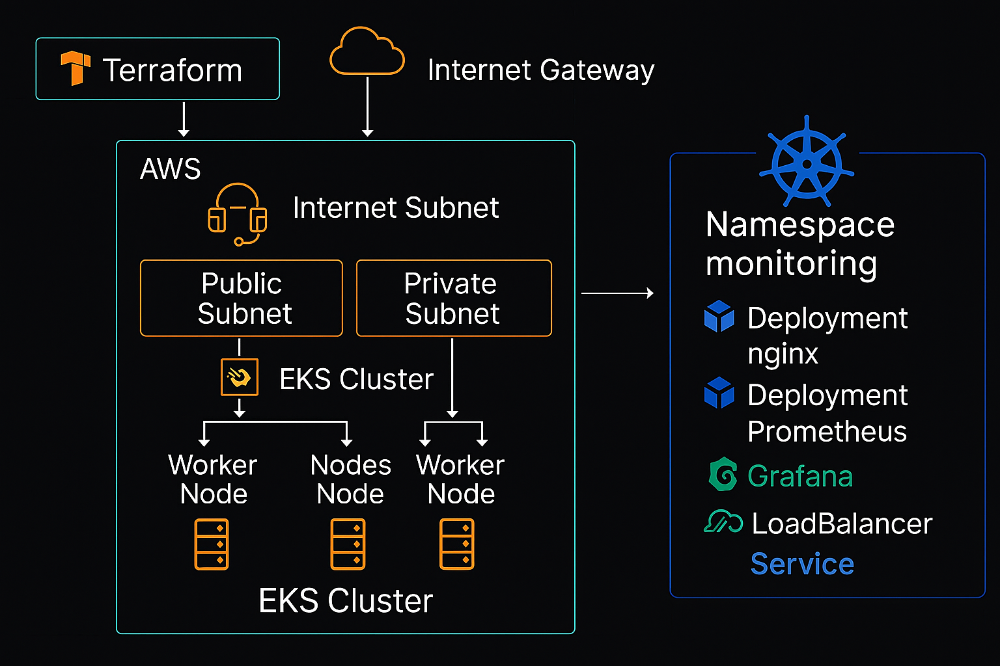

Proyecto de Infraestructura como Código para EKS en AWS

# Proyecto Final - DevOps Mundos E
Aquí se encuentra todo el código, la configuración de infraestructura y la documentación necesaria para ejecutar el proyecto.

## 📌 Descripción
Este proyecto implementa una infraestructura completa utilizando Terraform para desplegar un clúster EKS (Elastic Kubernetes Service) en AWS, junto con aplicaciones y herramientas de monitoreo.



## Estructura del Proyecto

- **environments/**
  - **dev/**
    - `main.tf` — Configuración principal para el entorno de desarrollo
    - `variables.tf` — Definición de variables para desarrollo
    - `terraform.tfvars` — Valores específicos de variables para desarrollo
    - `providers.tf` — Configuración de proveedores para desarrollo
    - `outputs.tf` — Outputs del entorno de desarrollo

- **modules/**
  - **eks/**
    - `main.tf` — Configuración del módulo EKS
    - `variables.tf` — Variables del módulo EKS
    - `outputs.tf` — Outputs del módulo EKS
  - **aws-auth/**
      - `main.tf` — Lógica para crear/actualizar el ConfigMap aws-auth
      - `variables.tf` — Variables para definir usuarios y roles IAM
      - `outputs.tf` — Outputs relacionados al aws-auth (opcional)

- **vpc/**
    - `main.tf` — Configuración del módulo VPC
    - `variables.tf` — Variables del módulo VPC
    - `outputs.tf` — Outputs del módulo VPC

- **nginx-app/**
    - `main.tf` — Configuración de despliegue de Nginx
    - `variables.tf` — Variables para Nginx
    - `outputs.tf` — Outputs del módulo Nginx

- **monitoring/**
    - `main.tf` — Configuración de Prometheus y Grafana
    - `variables.tf` — Variables para el monitoreo
    - `outputs.tf` — Outputs del módulo de monitoreo

- `README.md` — Documentación principal del proyecto

Requisitos Previos

- Terraform (v1.3.2 o superior)
- AWS CLI configurado con las credenciales adecuadas
- kubectl para interactuar con el clúster
- eksctl (opcional, para gestión avanzada del clúster)

Módulos

**VPC**   
El módulo VPC crea la infraestructura de red necesaria para el clúster EKS:
- VPC dedicada para el clúster
- Subredes públicas y privadas distribuidas en múltiples zonas de disponibilidad
- NAT Gateway para permitir que los nodos en subredes privadas accedan a Internet
- Tablas de enrutamiento y otros componentes de red

**EKS**  
El módulo EKS despliega y configura el clúster Kubernetes:
- Clúster EKS con la versión especificada de Kubernetes (por ejemplo, "1.23")
- Grupos de nodos gestionados (Managed Node Groups)
- Configuración de red y seguridad

**aws-auth**  
El submódulo `aws-auth` (ubicado en `modules/eks/aws-auth/`) gestiona el ConfigMap `aws-auth` en el namespace `kube-system` del clúster. Este ConfigMap es esencial para definir los mapeos entre usuarios/roles de IAM y los grupos de Kubernetes (como `system:masters`). La configuración incluye:
- **Archivo `variables.tf`:** Define variables como `aws_auth_users` y `manage_aws_auth_configmap` para controlar los accesos.
- **Archivo `main.tf`:** Contiene la lógica para crear o actualizar el ConfigMap `aws-auth` basado en las variables proporcionadas.
- **Archivo `outputs.tf`:** (Opcional) Expone salidas relacionadas con la configuración de aws-auth.

**Nota:** Si utilizas Terraform para gestionar el ConfigMap `aws-auth`, asegúrate de definir correctamente la variable `aws_auth_users` en el archivo `terraform.tfvars` del entorno y de establecer `manage_aws_auth_configmap = true`.

**nginx-app**  
Este módulo despliega una aplicación Nginx en el clúster:
- Deployment de Nginx con el número especificado de réplicas
- Servicio de tipo LoadBalancer para exponer Nginx externamente

**monitoring** 
El módulo de monitoreo implementa herramientas para observar y monitorear el clúster:
- Prometheus para recolección de métricas
- Grafana para visualización y dashboards
- Configuración de alertas (opcional)

**Configuración**  
Variables Principales  
Configure las siguientes variables en el archivo `terraform.tfvars` del entorno deseado:

```hcl
   # AWS configuration  
   aws_region  = "us-east-1"  
   aws_profile = "tu-perfil"

   # VPC configuration  
   vpc_name           = "eks-vpc-dev"  
   cidr               = "10.0.0.0/16"  
   availability_zones = ["us-east-1a", "us-east-1b", "us-east-1c"]  
   public_subnets     = ["10.0.1.0/24", "10.0.2.0/24", "10.0.3.0/24"]  
   private_subnets    = ["10.0.101.0/24", "10.0.102.0/24", "10.0.103.0/24"]

   # EKS configuration  
   cluster_name    = "eks-demo-cluster"  
   cluster_version = "1.23"  # Utiliza una versión soportada de Kubernetes

   # Configuración de acceso IAM para el clúster (aws-auth)  
   aws_auth_users = [  
   {  
      userarn  = "arn:aws:iam::ACCOUNT_ID:user/USERNAME"  
      username = "USERNAME"  
      groups   = ["system:masters"]  
   }  
   ]

   # Para gestionar el ConfigMap aws-auth
   manage_aws_auth_configmap = true
```


## 🚀 Cómo desplegar el proyecto

1. Inicializa la VPC:
   ```sh
   cd environments/dev
   terraform init
   terraform apply -target=module.vpc
   ```

2. Inicializa el cluster de EKS:
   ```sh
   terraform apply -target=module.eks
   ```

3. Inicializa el submodulo de Auth:
   ```sh
   terraform apply -target=module.eks_aws_auth
   ```
4. Inicializa Grafana y Prometheus
   ```sh
   terraform apply -target=module.monitoring.helm_release.kube_prometheus_stack -target=module.monitoring.null_resource.wait_for_crds
   ```
5. Instala el resto:
   ```sh
   terraform apply
   ```
6. Actualiza la configuracion de kubectl:
   ```sh
   aws eks update-kubeconfig --name eks-demo-cluster --region us-east-1
   ```
7. Para obtener la url de Grafana y Prometheus:
   ```sh
   kubectl get svc -n monitoring
   ```

## 🧹  Limpieza de Recursos
Para eliminar todos los recursos creados:
```sh
   terraform destroy
```

## 🔐  Consideraciones de Seguridad  
Por defecto el endpoint del clúster se configura con acceso público para facilitar el despliegue inicial.  
En entornos de producción, evalúa limitar el acceso público e implementar VPN o AWS Direct Connect.  
Revisa regularmente permisos IAM y la configuración del clúster.
